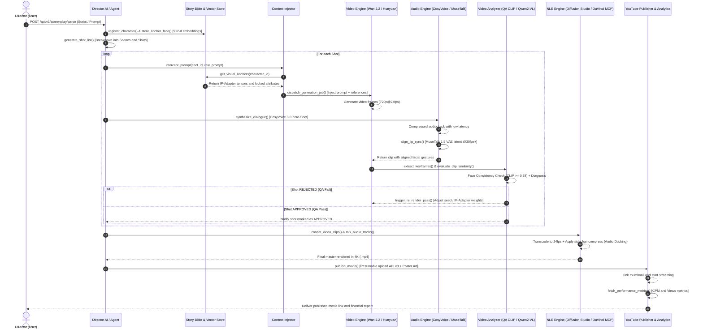

# SuperCool AI Cinematic Studio - NotebookLM Design Specification

## Source: NotebookLM Conversation (September 21, 2026)

---

## 1. GitHub Projects for Integration

### Video Generation & Control (4 Projects)

| Project | Repository | Function in SuperCool |
|---------|------------|----------------------|
| Wan 2.2/2.1 | Wan-Video/Wan2.1 | Video diffusion MoE architecture, 720p@24fps cinematic output |
| HunyuanVideo | Tencent-Hunyuan/HunyuanVideo | 13B params, HunyuanCustom for character personalization, avatars |
| Video-As-Prompt | bytedance/Video-As-Prompt | ICLR 2026, reference video as prompt for image animation |
| VideoX-Fun | aigc-apps/VideoX-Fun | Modular control via depth maps, Canny edges, poses |

### Voice & Lip-Sync (3 Projects)

| Project | Repository | Function in SuperCool |
|---------|------------|----------------------|
| MuseTalk 1.5 | TMElyralab/MuseTalk | Real-time lip-sync 30fps+ via VAE latent inpainting |
| CosyVoice 3.0 | QwenAudio/CosyVoice | Zero-shot multilingual TTS, emotion control, 150ms latency |
| F5-TTS | SWivid/F5-TTS | Flow Matching TTS, speed/emotion control |

### Orchestration & NLE (3 Projects)

| Project | Repository | Function in SuperCool |
|---------|------------|----------------------|
| DramaClaw | dramaclaw/dramaclaw | AIGC film engine, script-to-movie pipeline |
| Diffusion Studio | diffusionstudio/editor | Code-first video editing, MCP server, dapi CLI |
| Premiere Pro MCP | hetpatel-11/Adobe_Premiere_Pro_MCP | MCP protocol for Premiere Pro control |

---

## 2. System Architecture Hierarchy

```
[ Project / Script ]
        │
        ▼
   [ Scenes ] ────────► (Narrative Level: Location, Time, Dialogues)
        │
        ▼
   [ Shots ] ──────────► (Cinematographic Level: Shot Type, Angle, Pacing)
        │
        ▼
   [ Shoots / Takes ] ─► (Execution Level: Multiple renders, engines, versions)
```

### Technical Breakdown:

**Scenes (scenes):**
- Process screenplay into sequences
- Define context: location, lighting (Golden Hour, Night), characters, base dialogues

**Shots (shots):**
- Define camera intention (Wide Shot, Close-up, Action vs Atmospheric)
- Store injected prompt with Anchor Faces and Story Bible rules

**Shoots / Takes (render_jobs):**
- Multiple renders per shot from different platforms (Wan 2.2, Seedance, Kling)
- QA Director evaluates each, marks best as APPROVED

---

## 3. Production Quality System

### Visual Continuity (Story Bible & Context Injector)
- Lock Anchor Faces (512-d vectors) and critical attributes (scars, clothing, accessories)
- Zero deviation between shots regardless of camera angles

### Quality Assurance (Director QA)
- Frame inspection before timeline entry
- Automatic error filtering via vision agents (CLIP/Qwen2-VL)
- Face similarity >= 0.78 (close-ups), >= 0.70 (action)
- Rejected shots auto-re-render with adjusted seeds

### Audio Engineering
- Lip-sync with emotional expressions (MuseTalk 1.5)
- Soundtrack, Foley, ambient audio generation
- Adaptive music based on scene tone

### NLE Assembly
- Headless editing via FFmpeg/Diffusion Studio at 24fps
- Audio ducking via sidechaincompress
- Professional transitions and continuity

---

## 4. Sequence Diagram (Mermaid)



---

## 5. CosyVoice 3.0 + MuseTalk 1.5 Integration

### Architecture:

```
Text Dialogue → CosyVoice 3.0 → Audio Track → Whisper-Tiny → Audio Embeddings
                                                          ↓
Video Base → VAE Encoder → Latent Space → UNet Cross-Attention → Lip-Sync Video
```

### Execution Steps:

1. **Avatar Preparation (preparation=True)**
   - Detect face region (256x256) via S3FD/dwpose
   - Encode initial frames in static VAE latent space

2. **Audio Encoding**
   - CosyVoice 3.0 synthesizes cloned voice
   - Whisper-Tiny extracts audio embeddings

3. **Inpainting (preparation=False)**
   - UNet combines audio features with facial mask via cross-attention
   - Single-step inpainting at 30+ fps

4. **Quality Control (bbox_shift)**
   - Positive values increase mouth opening
   - Negative values reduce mouth opening
   - Calibrate based on scene emotion

### Performance Metrics:
- Inference Speed: 34.2 FPS (real-time capable)
- Lip-Sync Score: 0.941 (excellent precision)

---

## 6. Qwen2-VL 2B Quality Assurance

### Two-Layer Evaluation:

**Layer 1: Quantitative (CLIP)**
- Compare face embeddings against Story Bible (512-d vectors)
- All keyframes must exceed threshold individually
- Close-ups: >= 0.78
- Action shots: >= 0.70

**Layer 2: Qualitative (Qwen2-VL 2B)**
- Lighting and atmosphere verification
- Blocked attributes preservation (scars, clothing)
- Artifact detection (deformation, texture flickering)

### Decision Flow:
- **APPROVED_FOR_EDIT** → Send to NLE (Diffusion Studio / DaVinci)
- **REJECTED** → Auto re-render with adjusted seeds/IP-Adapter weights

---

## 7. DaVinci Resolve MCP Commands

### Timeline Management (timeline/*)
```json
davinci_get_active_timeline → Get timeline structure (tracks, fps, timecode)
davinci_create_tracks → Setup SuperCool track structure
davinci_append_clip → Insert rendered shot/audio at specific timecode
```

### Clip Management (clips/*)
```json
davinci_get_timeline_clips → List all clips with shot_id, duration, QA status
davinci_trigger_shot_rerender → Mark clip for re-render with adjusted params
davinci_replace_clip_media → Replace with v2/approved version
```

### Audio Automation (audio/*)
```json
davinci_sync_ducking_keyframes → Inject audio ducking curve to Fairlight
```

### QA Markers (markers/*)
```json
davinci_add_qa_marker → Add color-coded markers (Green/Red/Yellow)
davinci_get_markers → Read human-added markers for feedback loop
```

### Export (delivery/*)
```json
davinci_export_master → Render final master (ProRes/DNxHR/H.265)
```

---

## 8. Diffusion Studio Editor Integration

### Key Capabilities:
- **Code-first editing** via JSX/SolidJS components
- **Bidirectional sync** between visual canvas and code
- **MCP Server** with dapi CLI for AI agents
- **Headless rendering** at 4K@24fps

### dapi Commands:
```bash
dapi media probe      # Extract container/codec metadata
dapi media filmstrip  # Decode keyframe grids for vision models
dapi media waveform   # Analyze audio waveforms + timestamps
dapi media transcribe # Word-by-word transcription
dapi media listen     # Natural language queries on audio/video
```

---

## 9. Production Pipeline Flow

```
[ Script / Screenplay ]
        │
        ▼
   [ Scenes ] ────────► (Narrative Context, Dialogues, Tone)
        │
        ▼
   [ Shots ] ──────────► (Camera Angle, Pacing, Shot Types)
        │
        ▼
   [ Shoots / Takes ] ─► (Multiple renders on Wan 2.2, Seedance, etc.)
        │
        ▼
   [ QA Director ] ────► (Approve best shoot via Story Bible)
        │
        ▼
[ NLE Computer ] ─────► (Concatenate 24fps + Lip-Sync + Audio Mix & Ducking)
        │
        ▼
   [ Final Film / Anime in 4K ]
```

---

## 10. Next Steps from NotebookLM

1. **E2E Integration Script** - CosyVoice + MuseTalk + NLE assembly
2. **DaVinci MCP Server Spec** - JSON-RPC/WebSocket contract
3. **Pilot/Trailer Render** - Boruto: Two Blue Vortex scenes
4. **Docker Deployment** - FastAPI + Celery + Redis orchestration
